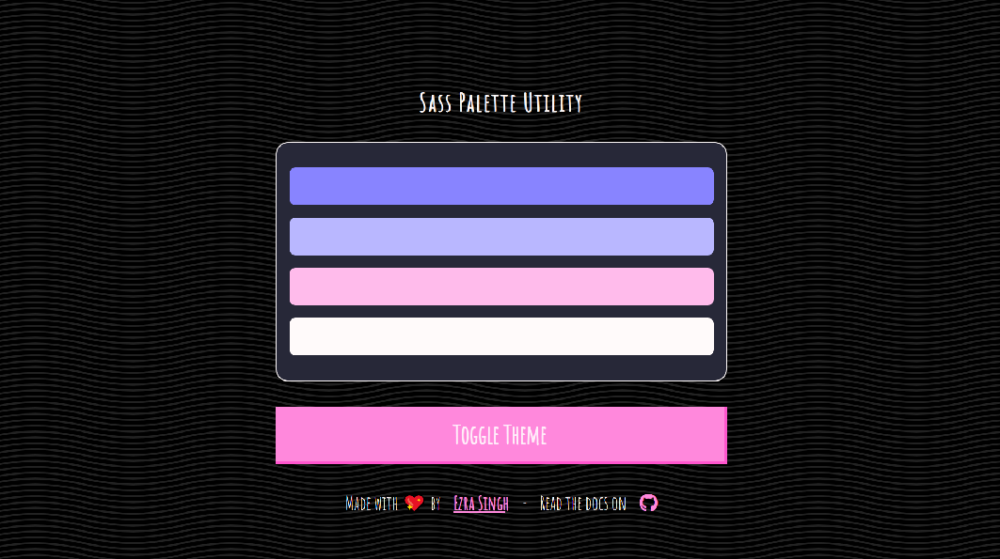

# Sass Palette Utility

> Manage UX themes with *blazing* ease

[](https://sass-palette-utility.netlify.com/)

[](https://app.netlify.com/sites/sass-palette-utility/deploys)

## Installation

`npm i --save sass-palette-utility`

## Usage

Create a palette by configuring the theme

`_theme.scss`
```scss
@import "~sass-palette-utility/lib/palette.scss";

$dark: #272838;
$light: #fffafa;
$brand: #8884ff;
$interactive: #ff88dc;
$contrast: 10;

$theme: $dark, $light, $brand, $interactive, $contrast;

$palette: new-palette($theme...);
```

Use built in functions to access swatches within the palette

`_components.scss`
```scss
@import "theme.scss";

.btn{
		color: ui-color-lighter($palette, 'interactive');
		background: ui-color($palette, 'interactive');
		&:hover{
			background: ui-color-light($palette, 'interactive');
			border-color: ui-color-dark($palette, 'interactive');
		}
		&:focus, &:active{
			color: ui-color-darker($palette, 'interactive');
			border-color: ui-color-dark($palette, 'interactive');
		}
}
```


## Multi-Theme Design Pattern

Here is a snippet for a sass mixin that helps to structure component style by some global theme switch

```html
<main data-theme="dark" class="app">
	<div class="app__container">
		<!-- Application Content -->
	</div>
</main>
```

```scss
@mixin theme($palette){
	.app[theme="#{$palette}"] & {
		@content;
	}
}
.app__container{
	@include theme("light") {
		background: ui-layout("light");
	}
	@include theme("dark") {
		background: ui-layout("dark");
	}
}
```
Toggling
the data attribute **`theme`** to either *`"light"`* or *`"dark"`*
on **`<main>`** controls the entire stylesheet now. This could be refactored to support more than just two styles by utilizing more than one palette.

Happy coding 👍
